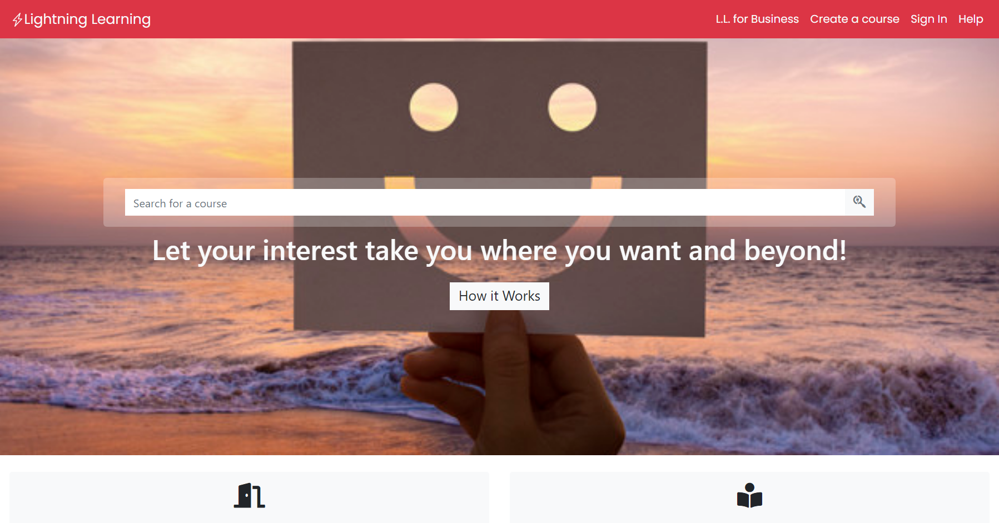

# Directory of Online Courses

## Online Courses Catalog Demo

This project contains three pages for an Online Course Directory.

1. Index page: Showing the main features of the sites.
2. Search results page: Showing several Online Courses after being searched.
3. Course page: The course page with the description of the course and other features.

## Built with
- [HTML5](https://html.spec.whatwg.org/): For layout.
- [CSS](https://www.w3.org/Style/CSS/): For complementing the Bootstrap Styling.
- [Bootstrap](https://getbootstrap.com/): For the main style and grid system.

## Screenshot

## Presentation of site

[Video Presentation](https://www.loom.com/share/fbf1bb0bb7ba45a49a09ad50f3c3dd31)

## Live Demo

[Live Demo Link](https://raw.githack.com/MrkarlosM/courses-directory/feature-branch/index.html)

👤 **Carlos Martinez**

- GitHub: [@MrkarlosM](https://github.com/MrkarlosM)
- Twitter: [@MrkarlosM](@MrkarlosM)
- LinkedIn: [Carlos Mario Martinez](https://www.linkedin.com/in/carlos-mario-martinez-b1768355/)

## 🤝 Contributing

Contributions, issues, and feature requests are welcome!

Feel free to check the [issues page](https://github.com/MrkarlosM/courses-directory/issues).

## Show your support

Give a ⭐️ if you like this project!

## Acknowledgement

Site's inspirational layout: [Mathew Njuguna](https://www.behance.net/gallery/25563385/PatashuleKE).

## 📝 License

This project is [MIT](LICENSE) licensed.
